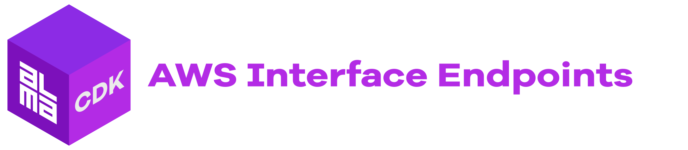

<div align="center">
	<br/>
	<br/>
  <h1>
	
  <br/>
  <br/>
  </h1>

  ```sh
  npm i -D @alma-cdk/domain
  ```

  <div align="left">

  Simplies creation of subdomain with a TLS certificate and configuration with services like AWS CloudFront.

  </div>
  <br/>
</div>


<br/>


## 🚧 &nbsp; Project Stability


This construct is still versioned with `v0` major version and breaking changes might be introduced if necessary (without a major version bump), though we aim to keep the API as stable as possible (even within `v0` development). We aim to publish `v1.0.0` soon and after that breaking changes will be introduced via major version bumps.


<br/>

## Getting Started

```ts
import { Domain } from '@alma-cdk/domain';
import * as cloudfront from 'aws-cdk-lib/aws-cloudfront';
import * as origins from 'aws-cdk-lib/aws-cloudfront-origins';
import * as s3 from 'aws-cdk-lib/aws-s3';
```
```ts
const myBucket: s3.IBucket; // Just for example

const domain = new Domain(this, 'Domain', {
  zone: 'example.com', // retrieve the zone via lookup, or provide IHostedZone
  subdomain: 'foobar', // optional subdomain, can be multilevel
});

const distribution = new cloudfront.Distribution(this, 'Distribution', {
  defaultBehavior: {
    origin: new origins.S3Origin(myBucket),
  },
  certificate: domain.certificate, // reference to created ICertificate
  domainNames: [domain.fqdn], // foobar.example.com
})

// assign CloudFront distribution to given fqdn with A + AAAA records
domain.assign(new targets.CloudFrontTarget(distribution))
```


